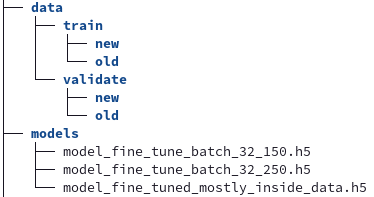

# README

To run this project first complete the following steps:

1. ## Installing Dependencies

    Install the required dependencies for the project using the command below:

    ```bash
    pip install -r requirements.txt
    ```

2. ## Download Dataset

    Download the required dataset zip file from the url below:

    <a href="https://1drv.ms/u/s!AtJ_2lfjyxCegXdkzijXP2G8fEBZ?e=qge9G9">https://1drv.ms/u/s!AtJ_2lfjyxCegXdkzijXP2G8fEBZ?e=qge9G9</a>

    Once downloaded, extract the downloaded zip into the `./data` directory

3. ## Download Models

    Download the pre-compiled models from the links below:

    - <a href="https://drive.google.com/file/d/1-6dA6wYSiKYy7atx8YHsrHBXXQpYkcp0/view?usp=sharing">https://drive.google.com/file/d/1-6dA6wYSiKYy7atx8YHsrHBXXQpYkcp0/view?usp=sharing</a>
    - <a href="https://drive.google.com/file/d/1-A1K3mdr5UqyhNH2ggxbtDTFF5HkrCkh/view?usp=sharing">https://drive.google.com/file/d/1-A1K3mdr5UqyhNH2ggxbtDTFF5HkrCkh/view?usp=sharing</a>
    - <a href="https://drive.google.com/file/d/1vhfGFzERNkrpBPSnCjZB3QPjMho0Ahg7/view?usp=sharing">https://drive.google.com/file/d/1vhfGFzERNkrpBPSnCjZB3QPjMho0Ahg7/view?usp=sharing</a>
    <br/><br/>

    Once the models have been downloaded place the models inside the `./models` folder.

    Once the dataset and models have been downloaded, the resulting folder structure of the data and models folders should look like:

    

 4. ## Start Voila Server
    Start the Voila Server using:
    ```
    ./start.sh
    ```
    Once the server has started locate and open the deployment notebook (`./Assignment_3_deploy.ipynb`) in the web UI.